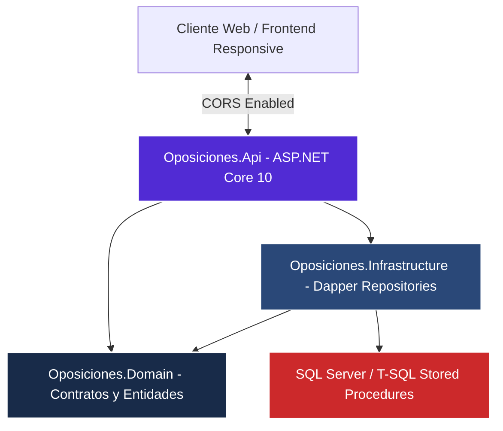

# Sistema de Oposiciones TAI - Plataforma Integral de Preparación y Test

[](https://dotnet.microsoft.com/)
[](#)
[](#)
[](https://www.naindev.com/SistemaOposicionesTAI/)

Plataforma inteligente y motor de examinación diseñado específica y arquitectónicamente para la preparación intensiva de las **Oposiciones TAI (Tecnologías de la Información y Comunicaciones de la Administración General del Estado - INAP)**. Desarrollado por un desarrollador backend para resolver un caso de uso crítico e intransferible: **su propio rendimiento en el estudio diario**.

---

## Demo Web en Vivo (Acceso Directo)
El sistema dispone de un cliente web responsive con estética premium desplegado en la nube pública de **GitHub Pages**, que opera con cero latencia mediante almacenamiento in-memory e historial local en tu dispositivo (`localStorage`):
- **[Acceder al Entorno Web de Práctica TAI (naindev.com/SistemaOposicionesTAI/)](https://www.naindev.com/SistemaOposicionesTAI/)**

---

## Características y Modalidades del Sistema

1. **Modo Estudio (Aprendizaje en Tiempo Real):** Validación instantánea en verde/rojo tras seleccionar cada respuesta, favoreciendo la asimilación activa de conceptos en los 4 Bloques del temario sin necesidad de esperar a la conclusión del test.
2. **Modo Examen Oficial INAP (Temporizador y Baremación Real):** Simulación estricta de las condiciones de examen público: cuenta atrás visible, ocultación de soluciones durante el desarrollo y cálculo automático de la nota con el baremo oficial (**+1,0 punto por acierto, -0,33 puntos por fallo**, 0,0 por respuesta en blanco).
3. **Analítica y Rendimiento por Temario:** Almacén persistente local en el navegador que archiva el histórico de intentos, porcentaje general de aciertos e identifica matemáticamente los bloques donde se concentran más fallos para focalizar las sesiones de repaso.
4. **Arquitectura Híbrida Inteligente:** Capaz de conectarse transparentemente a esta API .NET 10 y SQL Server en entornos corporativos o locales, con conmutación automática a catálogos JSON in-memory en despliegues estáticos en la nube.

---

## Arquitectura Backend (.NET 10 + Dapper + T-SQL)

El cerebro backend aplica **Clean Architecture**, separando estrictamente los contratos del dominio, la capa de acceso a datos de alto rendimiento con **Dapper** y la exposición REST con **ASP.NET Core 10**:



### Estructura de la Solución

| Proyecto / Directorio | Descripción y Rol Arquitectónico | Estado |
| :--- | :--- | :--- |
| `src/Oposiciones.Domain/` | Modelos inmutables de preguntas, bloques, temas e historial de intentos | .NET 10 |
| `src/Oposiciones.Infrastructure/` | Repositorios de alto rendimiento optimizados con **Dapper** | .NET 10 |
| `src/Oposiciones.Api/` | Endpoints RESTful, Swagger UI interactivo y configuración CORS universal | .NET 10 |
| `db/` | Scripts T-SQL para generación de esquemas relacionales, seeding y stored procedures | Activo |

---

## Instalación y Ejecución Local

### 1. Requisitos Previos
- .NET 10 SDK o superior.
- SQL Server (LocalDB, Developer Edition o Azure SQL).

### 2. Base de Datos
Ejecuta los scripts ubicados en la carpeta `db/` en orden secuencial sobre tu instancia de SQL Server:
```sql
-- 001_create_schema.sql
-- 002_seed_minimal.sql
-- 003_procedures.sql
-- 004_attempts_procedures.sql
```

### 3. Compilación y Arranque de la API
```powershell
dotnet build src/Oposiciones.sln
dotnet run --project src/Oposiciones.Api/Oposiciones.Api.csproj
```

---

## Licencia y Autor
Diseñado y desarrollado por **[NainDev (Aitor Nain)](https://github.com/Nain9Dev)**. Construido como herramienta real para estudio competitivo y demostración técnica de Clean Architecture con .NET 10 y SQL Server.
