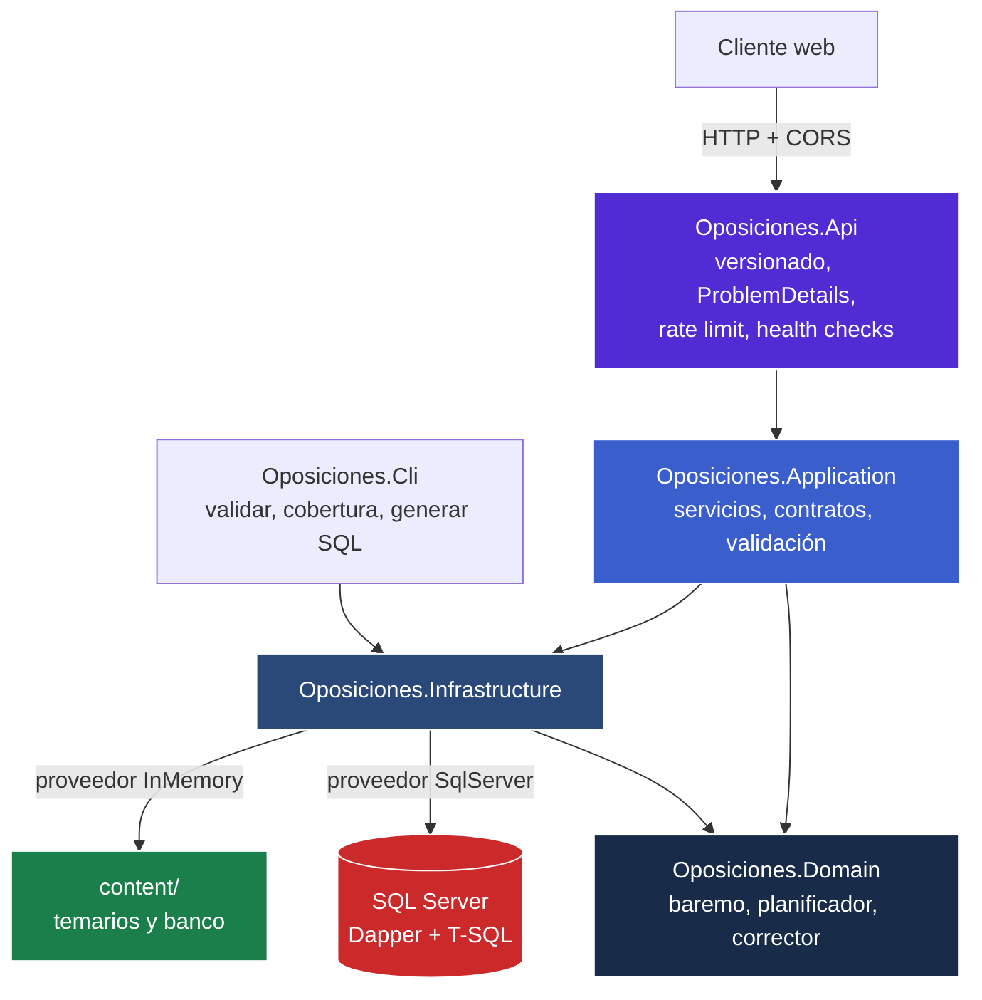

# Sistema de Oposiciones TAI - Plataforma de Preparación y Motor de Examinación

[](https://dotnet.microsoft.com/)
[](#arquitectura)
[](db/README.md)
[](#pruebas)
[](https://www.naindev.com/SistemaOposicionesTAI/)

Plataforma de estudio y motor de examinación para las **oposiciones TAI** (Cuerpo de Técnicos
Auxiliares de Informática de la Administración del Estado). Desarrollada por un desarrollador
backend para resolver un caso de uso propio e intransferible: **su rendimiento en el estudio
diario**.

El sistema reproduce el ejercicio oficial hasta en el detalle que más duele: **80 preguntas más 5 de
reserva, 120 minutos, penalización de un tercio por error y calificación de 0 a 50 puntos con un
mínimo de 25 para superarlo**, según la convocatoria publicada en el
[BOE núm. 166, de 10 de julio de 2024](https://www.boe.es/diario_boe/txt.php?id=BOE-A-2024-14139).

---

## Demo web en vivo

Cliente web responsive desplegado en GitHub Pages, con historial local en el navegador:

- **[Entorno de práctica TAI (naindev.com/SistemaOposicionesTAI)](https://www.naindev.com/SistemaOposicionesTAI/)**

---

## Arranque en un minuto

No hace falta base de datos ni ningún paso previo. El temario y el banco de preguntas viajan con la
aplicación y el proveedor en memoria los sirve directamente:

```bash
dotnet run --project src/Oposiciones.Api
```

Swagger queda en `http://localhost:5298/swagger`. Un simulacro completo, repartido según el peso de
cada bloque del temario oficial:

```bash
curl -X POST http://localhost:5298/api/tests/generate \
     -H "Content-Type: application/json" \
     -d '{"examCode":"TAI","mode":"exam","totalQuestions":80}'
```

Con contenedores:

```bash
docker compose up api                     # API sola, banco en memoria
docker compose --profile sqlserver up     # API + SQL Server con esquema y contenido cargados
```

---

## Qué hace el sistema

### Generación declarativa de tests

No se pide "un test del tema 7": se describe el examen que se quiere y el planificador resuelve el
reparto. Sin secciones, se reparte según el peso de cada bloque en el temario oficial; con
secciones, se controla hasta el nivel de tema, por número exacto de preguntas o por porcentaje.

```jsonc
{
  "examCode": "TAI",
  "mode": "exam",
  "totalQuestions": 40,
  "seed": 20260523,          // fijar la semilla reproduce el examen exacto
  "difficulties": [3, 4, 5],
  "sections": [
    { "blockCode": "I", "questionCount": 12 },              // reparto exacto
    { "blockCode": "IV", "weightPercent": 60 },             // reparto por porcentaje
    { "blockCode": "III", "topicNumber": 21, "tags": ["accesibilidad"] }
  ]
}
```

El reparto siempre suma el total pedido: los decimales se asignan por el método del resto mayor. Si
un tema tiene poco material, el hueco se cubre **dentro del ámbito solicitado** y nunca con
preguntas de temas que no se pidieron.

### Reproducibilidad por semilla

La misma semilla produce exactamente el mismo examen: las mismas preguntas, en el mismo orden y con
las opciones barajadas igual. Sirve para compartir un simulacro, repetirlo pasadas dos semanas y
comparar, o reproducir un fallo. El generador es un xorshift128+ propio en lugar de `Random`,
precisamente para que esa promesa se mantenga entre máquinas y versiones del framework.

### Modo estudio y modo examen

La diferencia no es cosmética: **en modo examen la solución, la explicación y la referencia
normativa no salen del servidor**. No hay forma de resolver el simulacro leyendo la respuesta HTTP.
Las soluciones aparecen al cerrar el intento, en `GET /api/attempts/{id}/review`.

### Corrección con el baremo real y analítica por temario

La corrección devuelve el desglose completo, no solo la nota, y el rendimiento por bloque y por
tema. De ahí sale el plan de repaso, que señala los temas por debajo del umbral de acierto y cuántas
preguntas conviene hacer de cada uno, en un formato que encaja directamente en una nueva petición de
generación.

```
GET /api/attempts/study-plan?userName=nain&examCode=TAI
```

### Banco de preguntas con fuente oficial verificable

Cada pregunta cita la norma o el estándar del que procede: artículo de la Constitución, de la Ley
39/2015, del RGPD, del Esquema Nacional de Seguridad, RFC del IETF, pauta del W3C. La fuente no es
decorativa: es el criterio con el que se revisa y se defiende cada respuesta.

`GET /api/questions/coverage` devuelve la cobertura tema a tema, **incluidos los temas todavía
vacíos**, que es exactamente la información con la que se decide por dónde seguir rellenando.

---

## Arquitectura



| Proyecto | Rol |
| :--- | :--- |
| `src/Oposiciones.Domain/` | Entidades, baremo configurable, planificador de tests y corrector. Sin dependencias externas. |
| `src/Oposiciones.Application/` | Servicios de caso de uso, contratos públicos y validación. Mantiene los controladores finos. |
| `src/Oposiciones.Infrastructure/` | Dos proveedores intercambiables: SQL Server con Dapper y en memoria sobre `content/`. |
| `src/Oposiciones.Api/` | Host HTTP: versionado, ProblemDetails, limitación de peticiones, caché de salida y sondas. |
| `src/Oposiciones.Cli/` | Herramienta de contenido: validar el banco, ver cobertura y generar el guion de carga. |
| `db/` | Esquema T-SQL, procedimientos almacenados y contenido generado. Ver [db/README.md](db/README.md). |
| `content/` | Temarios y banco de preguntas versionados. Ver [content/README.md](content/README.md). |
| `tests/` | 68 pruebas unitarias y 28 de integración sobre la API completa. |

### Dos proveedores, una sola abstracción

El dominio define las interfaces de repositorio y la infraestructura las implementa dos veces.
Cambiar de proveedor es cambiar una línea de configuración:

```jsonc
{
  "Persistence": {
    "Provider": "InMemory"   // o "SqlServer"
  }
}
```

El proveedor **en memoria** carga los ficheros JSON de `content/` y asigna identificadores de forma
determinista, de modo que dos arranques con el mismo contenido producen los mismos identificadores.
No es una maqueta: es el proveedor con el que corren las pruebas de integración y con el que la
plataforma funciona sin infraestructura.

El proveedor **SQL Server** usa Dapper sobre procedimientos almacenados, con reintentos ante errores
transitorios, tiempos de espera configurables y caché del temario.

### Decisiones que sostienen la flexibilidad

**El baremo es un dato, no una constante.** Puntos por acierto, penalización, puntuación en blanco,
escala y nota de corte viven en el perfil de la convocatoria. Un cambio en las bases es una edición
de contenido, no un despliegue.

**La corrección vive en el dominio, no en la base de datos.** Los procedimientos almacenados guardan
respuestas y resultados; la nota la calcula `AttemptGrader` aplicando el baremo. Cambiar la
penalización no obliga a reescribir T-SQL.

**El sistema es multi-oposición desde la raíz.** Todo el catálogo cuelga de una convocatoria. Añadir
otra oposición es añadir dos ficheros JSON: aparece sola en `/api/exams` y genera tests con su
propio baremo y su propio reparto por bloques.

**Cada test guarda su baremo y el orden barajado de sus opciones.** Un examen realizado hace meses
se sigue corrigiendo con las reglas que tenía entonces, y su revisión muestra la misma pantalla que
vio el opositor.

---

## API

Todas las rutas responden también bajo `/api/v1/...`. La versión puede indicarse en la ruta o en la
cabecera `X-Api-Version`.

| Método | Ruta | Descripción |
| :--- | :--- | :--- |
| `GET` | `/api/exams` | Convocatorias disponibles con su baremo y formato. |
| `GET` | `/api/exams/{code}` | Convocatoria con el temario completo. |
| `GET` | `/api/exams/{code}/topics?blockCode=II` | Temas, opcionalmente por bloque. |
| `GET` | `/api/questions` | Búsqueda paginada del banco por bloque, tema, dificultad, etiquetas o texto libre. |
| `GET` | `/api/questions/coverage` | Cobertura por tema, incluidos los temas vacíos. |
| `POST` | `/api/tests/generate` | Genera un test a partir de una receta declarativa. |
| `GET` | `/api/tests/{id}` | Recupera un test. Sin soluciones si es modo examen. |
| `POST` | `/api/attempts/start` | Inicia un intento sobre un test. |
| `POST` | `/api/attempts/{id}/answer` | Responde una pregunta. `answerOptionId` nulo la deja en blanco. |
| `POST` | `/api/attempts/{id}/finish` | Cierra el intento y devuelve la corrección. Idempotente. |
| `GET` | `/api/attempts/{id}/review` | Test con soluciones. Solo tras finalizar. |
| `GET` | `/api/attempts/history` | Historial paginado del usuario. |
| `GET` | `/api/attempts/study-plan` | Plan de repaso derivado del historial. |
| `GET` | `/health/live`, `/health/ready` | Sondas de proceso vivo y de almacén disponible. |

Los errores se devuelven como `ProblemDetails` (RFC 9457) con el código HTTP que corresponde:
`400` para entradas inválidas, `404` para recursos inexistentes, `409` cuando el banco no da para
el test pedido y `429` al superar el límite de peticiones.

---

## Instalación

### Requisitos

- .NET 10 SDK.
- SQL Server 2016 o superior, **solo** si se usa el proveedor `SqlServer`.

### Con SQL Server

```bash
# 1. Esquema y procedimientos almacenados
for script in db/migrations/*.sql; do
  sqlcmd -S localhost -U sa -P "<contraseña>" -d OposicionesTAI -b -i "$script"
done

# 2. Contenido
sqlcmd -S localhost -U sa -P "<contraseña>" -d OposicionesTAI -b -i db/seed/content.sql

# 3. Arrancar contra SQL Server
Persistence__Provider=SqlServer dotnet run --project src/Oposiciones.Api
```

Detalles y decisiones de diseño de la base de datos en [db/README.md](db/README.md).

---

## Ampliar el banco de preguntas

El banco se rellena editando JSON, sin tocar código ni SQL:

```bash
dotnet run --project src/Oposiciones.Cli -- coverage                        # ¿por dónde sigo?
# ... se añaden preguntas a content/questions/*.json ...
dotnet run --project src/Oposiciones.Cli -- validate                        # ¿está bien?
dotnet run --project src/Oposiciones.Cli -- sql --out db/seed/content.sql   # regenerar carga SQL
```

La integración continua repite estas tres órdenes y falla si alguna pregunta se queda sin respuesta
correcta, sin fuente oficial o apuntando a un tema inexistente. El formato completo está en
[content/README.md](content/README.md).

---

## Pruebas

```bash
dotnet test Oposiciones.sln
```

- **68 pruebas unitarias**: baremo contra los números del ejercicio oficial, reparto del
  planificador, corrección y desglose, determinismo del generador, validación del contenido y
  proveedor en memoria.
- **28 pruebas de integración**: la API completa en memoria, incluido el ciclo generar, responder,
  corregir y revisar, y las garantías de que el modo examen no filtra soluciones.
- **Control de calidad del banco real**: hay pruebas que se ejecutan sobre el contenido del
  repositorio y exigen que las 33 asignaturas del temario tengan preguntas, que cada una tenga
  exactamente una respuesta correcta, cuatro opciones, explicación y fuente citada.

---

## Licencia y autor

Diseñado y desarrollado por **[NainDev (Aitor Nain)](https://github.com/Nain9Dev)**. Herramienta
real de estudio competitivo y demostración técnica de Clean Architecture con .NET 10, Dapper y
SQL Server.
