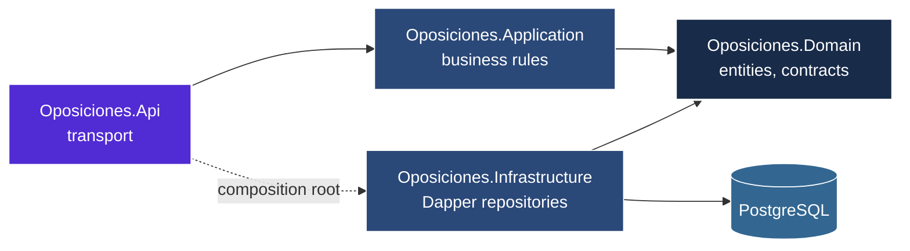

# Sistema Oposiciones TAI — Backend

[](https://dotnet.microsoft.com/)
[](docs/20-architecture.md)
[](docs/21-data-model.md)
[](docs/README.md)

REST API for an exam-simulation platform aimed at the Spanish **TAI** civil service
examination (Técnico Auxiliar de Informática, INAP). It serves a question bank drawn from
the official syllabus, marks attempts under the official scale and reports where a
candidate's performance is weakest.

Built as a working study tool first and a technical demonstration second — which is why the
things it gets wrong get fixed rather than hidden.

## Features

- **Study mode.** Randomised questions filtered by syllabus block, topic and difficulty.
- **Official INAP marking.** +1.00 per correct answer, −0.33 per wrong one, 0.00 for blanks.
  Computed on the server; a tampered client cannot declare its own grade.
- **Attempt lifecycle.** Start, answer question by question, finish. Answers are validated
  against the attempt's own test, and an attempt belongs to exactly one candidate.
- **Progress analytics.** Accuracy, average grade, weighted per-block breakdown, trend over
  the last ten attempts, and the weakest block once the sample is large enough to mean
  anything.
- **Cookie sessions.** The JWT never reaches JavaScript. `HttpOnly` cookies plus a
  session-scoped CSRF token, with rotation and effective logout.

## Architecture

Clean Architecture over four projects, dependencies pointing inwards.


```mermaid
flowchart LR
    API["Oposiciones.Api<br/>transport"] --> APP["Oposiciones.Application<br/>business rules"]
    APP --> DOM["Oposiciones.Domain<br/>entities, contracts"]
    INFRA["Oposiciones.Infrastructure<br/>Dapper repositories"] --> DOM
    API -.->|composition root| INFRA
    INFRA --> PG[("PostgreSQL")]

    style API fill:#512BD4,stroke:#fff,stroke-width:2px,color:#fff
    style APP fill:#2A4878,stroke:#fff,color:#fff
    style DOM fill:#182B49,stroke:#fff,stroke-width:2px,color:#fff
    style INFRA fill:#2A4878,stroke:#fff,color:#fff
    style PG fill:#336791,stroke:#fff,color:#fff
```

Full detail in [`docs/20-architecture.md`](docs/20-architecture.md).

## Quick start

```bash
docker run -d --name tai-db -e POSTGRES_PASSWORD=tai -e POSTGRES_USER=tai -e POSTGRES_DB=oposicionestai -p 55432:5432 postgres:16-alpine
```

```bash
for f in db/*.sql; do docker exec -i tai-db psql -U tai -d oposicionestai -v ON_ERROR_STOP=1 -q < "$f"; done
```

```bash
dotnet run --project src/Oposiciones.Api/Oposiciones.Api.csproj
```

Swagger lives at `/swagger` in development. Step-by-step instructions, configuration
reference and troubleshooting are in [`docs/60-runbook.md`](docs/60-runbook.md).

## Verification

```bash
dotnet test tests/Oposiciones.UnitTests
```

```bash
bash scripts/verify-api.sh
```

70 unit tests over the business rules and 48 end-to-end assertions over the public contract.
The end-to-end script needs a running instance and a migrated database; it exits non-zero on
failure, so it works as a deployment gate.

## API surface

| Method | Route | Auth | Purpose |
| :--- | :--- | :--- | :--- |
| `GET` | `/api/health`, `/api/health/db` | — | Liveness and readiness |
| `GET` | `/api/syllabus/blocks`, `/api/syllabus/topics` | — | Official syllabus |
| `GET` | `/api/preguntas` | — | Randomised questions |
| `GET` | `/api/preguntas/bloque/{bloque}` | — | Questions for one block |
| `GET` | `/api/preguntas/disponibilidad` | — | How many questions match a filter |
| `POST` | `/api/auth/register`, `/api/auth/login` | — | Account and session |
| `POST` | `/api/auth/refresh`, `/api/auth/logout` | cookie | Session rotation and teardown |
| `GET` | `/api/auth/me` | cookie | Current profile |
| `POST` | `/api/progreso` | cookie + CSRF | Record an attempt |
| `GET` | `/api/progreso/historial` | cookie | Paginated history |
| `GET` | `/api/progreso/estadisticas` | cookie | Performance dashboard |
| `DELETE` | `/api/progreso/historial` | cookie + CSRF | Clear own history |
| `GET` | `/api/tests/{id}` | — | Test detail, without the answer key |
| `POST` | `/api/tests/generate` | cookie + CSRF | Generate a test |
| `POST` | `/api/attempts/start`, `/{id}/answer`, `/{id}/finish` | cookie + CSRF | Attempt lifecycle |

The block selector accepts the curriculum ordinal (`1`–`4`), the roman code (`I`–`IV`) and
the wildcard `all`. All three resolve to the same block — see
[ADR-0004](docs/30-decisions/ADR-0004-block-ordinal-not-id.md) for why that distinction
turned out to matter.

## Documentation

This repository follows **Spec Driven Development**: every change starts in a document.
Start at [`docs/README.md`](docs/README.md).

- [Charter](docs/00-charter.md) — goal, scope, non-goals
- [Requirements](docs/10-requirements.md) — `REQ-###` in EARS notation
- [Open questions](docs/11-open-questions.md) — unresolved ambiguity, and what it blocks
- [Architecture](docs/20-architecture.md) · [Data model](docs/21-data-model.md)
- [Decisions](docs/30-decisions/) — six ADRs
- [Tasks](docs/40-tasks.md) · [Blockers](docs/41-blockers.md)
- [Traceability](docs/50-traceability.md) — every requirement and the test that proves it
- [Runbook](docs/60-runbook.md) · [Changelog](docs/90-changelog.md)

Agent instructions live in [`AGENTS.md`](AGENTS.md).

## Client

The web client is a separate repository:
[tai-study-system-js](https://github.com/Nain9Dev/tai-study-system-js).

## Author

Built by [NainDev (Aitor Nain)](https://github.com/Nain9Dev).
