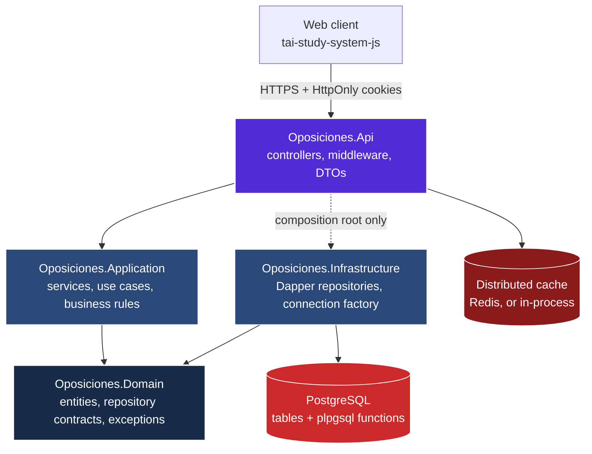
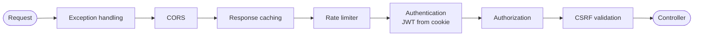
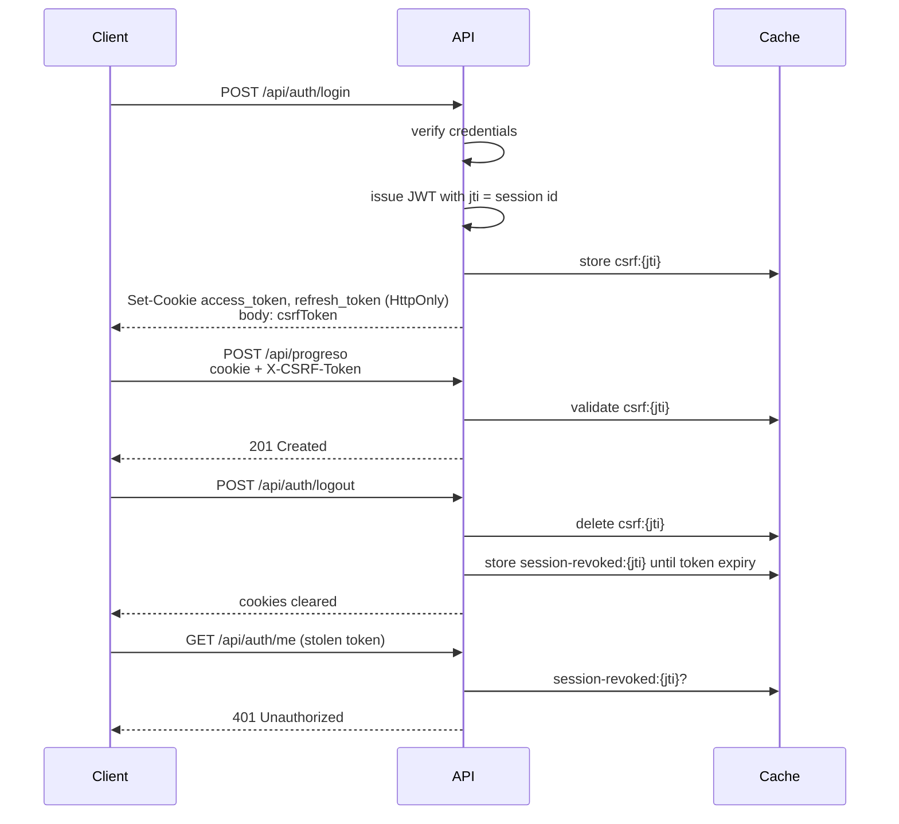

# 20 — Architecture

## Layers

Clean Architecture with four projects. Dependencies point inwards only: `Domain` knows
nothing about anyone, and no layer above ever reaches past its immediate neighbour.

## Contract of each layer

### Oposiciones.Domain

Entities, repository interfaces and business exceptions. No package references at all, not
even to the dependency-injection abstractions. Domain exceptions (`NotFoundException`,
`ConflictException`, `ForbiddenException`, `BusinessRuleException`) express intent without
knowing anything about HTTP; the API layer maps them to status codes.

### Oposiciones.Application

Use cases and business rules. It is the **only** layer allowed to decide anything:

- `ScoringService` is the single source of truth for the INAP marking scale.
- `BlockSelector` translates the client's block selector into a database filter.
- `ProgresoService` recomputes every stored attempt; the client's numbers are inputs, never
  results.
- `AttemptService` enforces attempt ownership before any repository call.

### Oposiciones.Infrastructure

Dapper repositories and the connection factory. It holds no business rules — the closest it
comes is expressing an invariant in SQL (for instance rejecting an answer that does not
belong to the attempt's test), which belongs there because doing it in a single statement is
what makes it atomic.

`IDbConnectionFactory` wraps a singleton `NpgsqlDataSource` so the connection pool and the
prepared-statement cache are shared across the whole process.

### Oposiciones.Api

Transport only: routing, model binding, validation, serialisation and the middleware
pipeline. Controllers hold no business logic; they resolve the caller's identity, delegate
to a service and translate the outcome.

## Request pipeline

Order matters and is asserted by the end-to-end script.

- **Exception handling first** so it wraps everything else. It never calls
  `Response.Clear()`, which would strip the CORS headers already written by the middleware
  below it and leave the browser unable to read the error body.
- **CORS before the rate limiter** so a `429` still reaches the browser with the headers it
  needs to expose the response.
- **CSRF after authentication** because the check only applies to authenticated,
  state-changing requests; anonymous traffic has no privilege to hijack.

## Session model

The access token never reaches JavaScript. That removes token theft via XSS but means the
browser attaches the cookie to cross-site requests on its own, so CSRF protection becomes
mandatory.

The revocation list exists because a JWT is self-contained: deleting the cookie only affects
the cooperating client. Entries live exactly as long as the token they invalidate, so the
list purges itself.

## Where the marking scale lives

The scale is expressed twice on purpose, and the duplication is deliberate and tested:

| Location | Purpose |
| :--- | :--- |
| `ScoringService` (Application) | Marks attempts submitted whole by the client through `/api/progreso` |
| `AttemptFinish` (plpgsql) | Marks attempts answered question by question, where the answers only exist in the database |

Both are pinned by tests to the same constants. Computing the second one in C# would mean
pulling every answer over the wire to add them up.

## Deliberate deviations

| Deviation | Reason |
| :--- | :--- |
| `PreguntasController` is anonymous | Guest mode is a product feature and the same catalogue ships as a static file. Protected by a rate limit. |
| The API project references Infrastructure | Only in the composition root, to register implementations. No controller imports a repository. |
| Repositories return `IReadOnlyList<T>` | Forces materialisation before the connection closes and stops a lazy `IEnumerable` from escaping the `using` block. |
