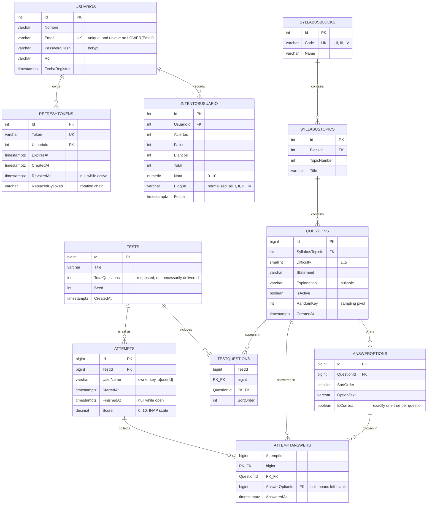

# 21 — Data model

PostgreSQL. Identifiers are unquoted, so the server folds them to lower case; Dapper matches
columns case-insensitively, which is why the C# properties keep their pascal casing.

## Entity relationships

## Invariants

| Invariant | Enforced by |
| :--- | :--- |
| An email identifies one account, regardless of case | `UNIQUE (Email)` plus `UNIQUE INDEX ON (LOWER(Email))` |
| A question has exactly one correct option | `UNIQUE INDEX ON AnswerOptions (QuestionId) WHERE IsCorrect` |
| An option belongs to the question it answers | `UNIQUE (QuestionId, SortOrder)` and the guard inside the answer statement |
| An answer belongs to the attempt's test | `INSERT ... SELECT ... JOIN TestQuestions` in `AttemptRepository.AnswerAsync` |
| A finished attempt accepts no more answers | `AND a.FinishedAt IS NULL` in the same statement |
| Correct + wrong + blank never exceeds the total | `CK_IntentosUsuario_Suma` and `ScoringService` clamping |
| A grade lies between 0 and 10 | `CK_IntentosUsuario_Nota` and `GREATEST(0, ...)` in `AttemptFinish` |
| Deleting a user removes their tokens and history | `ON DELETE CASCADE` |

## Two decisions worth explaining

### Every timestamp is `timestamptz`

Npgsql 6 made it an error to write a `DateTime` with `Kind=Utc` into a
`timestamp without time zone` column. Every timestamp in this codebase comes from
`DateTime.UtcNow`, so registering a user and issuing a refresh token both threw at runtime
against the original schema. Migration `005` converts the columns, reading the existing
values as UTC. See [ADR-0003](30-decisions/ADR-0003-timestamptz-everywhere.md).

### The block ordinal is not the block id

`SyllabusBlocks.Id` is an `IDENTITY` column and the seed populated it from a `VALUES` list
with no `ORDER BY`, so PostgreSQL was free to assign `Id = 1` to block IV. The client sends
the curriculum position, so treating it as an id returned the wrong block — or an empty
list. `BlockSelector` now maps the ordinal to the roman code and the seed pins the insertion
order. See [ADR-0004](30-decisions/ADR-0004-block-ordinal-not-id.md).

## Migrations

Applied in filename order. They are idempotent where it is cheap to be, so re-running the
folder against an existing database is safe.

| File | Contents |
| :--- | :--- |
| `001_create_schema.sql` | Base tables and indexes |
| `002_add_refresh_tokens.sql` | Refresh token storage |
| `002_seed_minimal.sql` | The four syllabus blocks and one topic each |
| `003_procedures.sql` | `TestGenerate` |
| `004_attempts_procedures.sql` | `AttemptStart`, `AttemptAnswerUpsert`, `AttemptFinish` |
| `005_progress_schema.sql` | `IntentosUsuario`, indexes, `timestamptz` conversion, case-insensitive email index |
| `006_attempt_scoring.sql` | `AttemptFinish` rewritten to the INAP scale; supporting indexes |
| `007_seed_questions.sql` | Question bank, idempotent |
